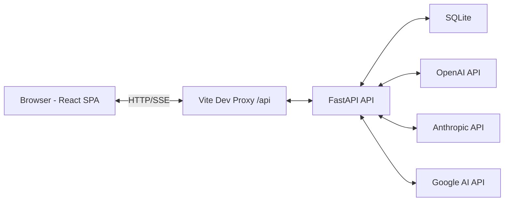

# Sona — Technology Stack

Definitive technology reference for the Sona project. Every library and tool listed here has been chosen deliberately. If it's not in this document, it's not in the stack.

---

## Architecture Overview

Split architecture: Python FastAPI backend + React Vite SPA frontend. Monolith-in-a-repo pattern — single repo, two apps, no microservices. The API handles all data persistence and LLM calls; the frontend is a pure SPA that consumes the API.



Clean separation: the frontend never touches the database or calls LLM APIs directly. All data flows through the FastAPI REST API.

---

## Backend

### Framework: FastAPI

- **What:** FastAPI 0.115+ with Uvicorn 0.32+ (ASGI server)
- **Why:** Native async/await for concurrent LLM streaming, Pydantic validation built-in, auto-generated OpenAPI/Swagger docs, massive representation in AI training data (strong AI code generation support)
- **Why not Django:** Async is second-class in Django. The ORM isn't async-native. Too much unused baggage for a single-user local app (auth, admin, middleware pipeline) — we'd be fighting the framework more than using it.
- **Why not Flask:** Async is bolted-on (Quart). No built-in validation — we'd need to reinvent what FastAPI provides out of the box (request parsing, response serialization, OpenAPI docs).

### Database: SQLite + SQLAlchemy 2.0 + Alembic

- **Engine:** SQLite — local app, no daemon to manage, file-based at `data/sona.db`
- **ORM:** SQLAlchemy 2.0+ with async sessions via aiosqlite 0.20+
- **Migrations:** Alembic 1.14+ — handles SQLite's ALTER TABLE limitations with batch operations
- **Why not Django ORM:** Tied to the Django framework. No async SQLite support.
- **Why not Tortoise ORM:** Smaller ecosystem, less mature, fewer resources for AI code generation.

### API Design: REST

- Standard REST endpoints matching the PRD's data model
- FastAPI's automatic OpenAPI/Swagger docs for every endpoint
- SSE (Server-Sent Events) via FastAPI `StreamingResponse` with async generators for LLM streaming responses
- **Why not GraphQL:** Overkill for a single-user local app with straightforward data access patterns. REST is simpler, and AI generates better REST code.

### LLM Integration: Native SDKs + Thin Abstraction

- **Direct SDKs:** openai 1.60+, anthropic 0.43+, google-generativeai 0.8+
- **Custom `LLMProvider` abstraction:** Unified interface for completion, streaming, and token counting. Each provider implements the interface with provider-specific logic.
- **Streaming:** FastAPI `StreamingResponse` with async generators → SSE to the frontend
- **Why not LiteLLM:** Too many transitive dependencies. Abstracts away features we need direct access to (model lists, pricing info, connection testing). The thin custom abstraction gives us full control with minimal code.

### Authentication: None

Single-user local app — no auth needed per PRD.

### File Parsing

| Format | Library | Notes |
|--------|---------|-------|
| .docx | python-docx 1.1+ | Direct text extraction from Word documents |
| .pdf | pymupdf (PyMuPDF) 1.25+ | Fast native PDF parsing. pymupdf4llm 0.0.17+ for clean text extraction optimized for LLM consumption |
| .txt | Built-in Python | Standard file read |
| URL scraping | httpx 0.28+ + beautifulsoup4 4.12+ | httpx for async HTTP requests, BeautifulSoup with lxml 5.3+ parser for HTML text extraction |

### Backend Utilities

- **pydantic-settings 2.7+** — `.env` file management and settings validation (extends Pydantic)
- **nanoid 2.0+** — ID generation matching PRD spec (Python nanoid package)

---

## Frontend

### Framework: React + Vite SPA

- **UI Library:** React 19+
- **Build Tool:** Vite 6+ with @vitejs/plugin-react 4.3+
- **Routing:** React Router 7+ (client-side SPA routing)
- **Language:** TypeScript 5.7+ (strict mode)
- **Why Vite over Next.js:** Next.js API routes are redundant when we have a Python backend. Vite is simpler and faster for a pure SPA. No SSR needed for a local app.
- **Why not Vue/Svelte:** React has a 2:1+ advantage in AI training data — better AI code generation. Largest component ecosystem (shadcn/ui, Radix, TanStack).

### Styling: Tailwind CSS v4 + shadcn/ui

- **Tailwind CSS 4.0+** — Utility-first CSS framework
- **shadcn/ui** — Accessible, customizable component library built on Radix UI primitives. Copy-paste model means no vendor lock-in. Components used include: Button, Input, Select, Slider, Textarea, Dialog, Tabs, Badge, Toast (via Sonner), Command/Combobox, Form, Popover, Card, and others as needed.

### State Management: TanStack Query + Zustand

- **TanStack Query (React Query) 5+** — All server state: API data fetching, caching, background refetching, optimistic updates
- **Zustand 5+** — Client-only state: UI preferences, filter selections, local storage persistence

### Charts: Recharts

- **Recharts 2.13+** — RadarChart component for Voice DNA visualization. SVG-based (accessible, interactive hover tooltips). Color-coded overlays for clone comparison view.

### Data Tables: TanStack Table

- **@tanstack/react-table 8.20+** — Headless table (styled with shadcn/ui + Tailwind). Built-in sorting, filtering, pagination, column visibility.
- **@tanstack/react-virtual 3.0+** — Virtual scrolling for 1000+ item content library

### Forms: React Hook Form + Zod

- **React Hook Form 7.54+** — Form state management with @hookform/resolvers 3.9+
- **Zod 3.24+** — Schema validation. Shares the validation-as-schema concept with Pydantic on the backend.

### Additional Frontend Libraries

| Library | Version | Purpose |
|---------|---------|---------|
| jspdf | 2.5+ | PDF export for content library |
| react-markdown | 9.0+ | Markdown rendering for methodology settings |
| react-dropzone | 14.3+ | Drag-and-drop file upload for writing samples |
| sonner | 1.7+ | Toast notifications (integrated with shadcn/ui) |
| nanoid | 5.0+ | Client-side ID generation |

---

## Developer Tooling

### Python

| Tool | Version | Purpose |
|------|---------|---------|
| Ruff | 0.9+ | Linter + formatter (replaces flake8 + Black, 100x faster) |
| Pyright | 1.1+ | Static type checker (strict mode) |
| uv | 0.6+ | Package manager (fast, deterministic, replaces pip + pip-tools) |
| pytest | 8.0+ | Test framework |
| pytest-asyncio | 0.24+ | Async test support |
| pytest-cov | 6.0+ | Coverage reporting |
| pre-commit | 4.0+ | Git hook framework |

### Frontend

| Tool | Version | Purpose |
|------|---------|---------|
| ESLint | 9.0+ | Linter (flat config format) |
| Prettier | 3.4+ | Code formatter |
| TypeScript | 5.7+ | Type checking (strict mode) |
| pnpm | 9.0+ | Package manager |
| Vitest | 3.0+ | Test framework |
| @testing-library/react | 16.0+ | Component testing |
| @testing-library/user-event | 14.5+ | User interaction simulation |
| MSW | 2.7+ | API mocking for tests |

---

## Infrastructure & DevOps

### Project Structure

```
sona/
├── backend/                # Python FastAPI
│   ├── app/
│   │   ├── main.py
│   │   ├── config.py
│   │   ├── api/            # Route handlers
│   │   ├── models/         # SQLAlchemy models
│   │   ├── schemas/        # Pydantic schemas
│   │   ├── services/       # Business logic
│   │   └── llm/            # Provider abstraction
│   ├── tests/
│   ├── alembic/
│   └── pyproject.toml
├── frontend/               # React + Vite
│   ├── src/
│   │   ├── components/
│   │   ├── pages/
│   │   ├── hooks/
│   │   ├── lib/
│   │   └── types/
│   ├── tests/
│   ├── package.json
│   └── vite.config.ts
├── data/                   # SQLite DB + avatars (gitignored)
├── docs/
├── Makefile
├── Procfile
└── .env.example
```

### Local Development

- **Dev proxy:** Vite proxies `/api` requests to `localhost:8000` (FastAPI)
- **Process manager:** Procfile with overmind or honcho to run both servers
- **No Docker** for v1 — native execution is sufficient for a local app
- **Database init:** FastAPI lifespan event creates tables on first startup

---

## Third-Party Services

| Service | Purpose |
|---------|---------|
| OpenAI API | LLM provider for voice analysis, content generation, authenticity scoring |
| Anthropic API | LLM provider (same capabilities, user choice) |
| Google AI / Gemini API | LLM provider (same capabilities, user choice) |

No other external services. Local app — URL scraping uses standard HTTP via httpx.

---

## Quick Reference: All Dependencies

### Backend (`pyproject.toml`)

```toml
[project]
dependencies = [
    # Core
    "fastapi>=0.115",
    "uvicorn[standard]>=0.32",
    "pydantic>=2.10",
    "pydantic-settings>=2.7",
    "sqlalchemy>=2.0",
    "aiosqlite>=0.20",
    "alembic>=1.14",

    # LLM
    "openai>=1.60",
    "anthropic>=0.43",
    "google-generativeai>=0.8",

    # File processing
    "python-docx>=1.1",
    "pymupdf>=1.25",
    "pymupdf4llm>=0.0.17",

    # HTTP & Scraping
    "httpx>=0.28",
    "beautifulsoup4>=4.12",
    "lxml>=5.3",

    # Utilities
    "nanoid>=2.0",
]

[project.optional-dependencies]
dev = [
    "pytest>=8.0",
    "pytest-asyncio>=0.24",
    "pytest-cov>=6.0",
    "ruff>=0.9",
    "pyright>=1.1",
    "pre-commit>=4.0",
]
```

### Frontend (`package.json`)

```jsonc
{
  "dependencies": {
    // Core
    "react": "^19.0",
    "react-dom": "^19.0",
    "react-router-dom": "^7.0",

    // UI
    "tailwindcss": "^4.0",
    // @radix-ui/react-* (installed via shadcn/ui)

    // State
    "@tanstack/react-query": "^5.0",
    "zustand": "^5.0",

    // Data display
    "recharts": "^2.13",
    "@tanstack/react-table": "^8.20",
    "@tanstack/react-virtual": "^3.0",

    // Forms
    "react-hook-form": "^7.54",
    "@hookform/resolvers": "^3.9",
    "zod": "^3.24",

    // Utilities
    "jspdf": "^2.5",
    "react-markdown": "^9.0",
    "react-dropzone": "^14.3",
    "sonner": "^1.7",
    "nanoid": "^5.0"
  },
  "devDependencies": {
    // Build
    "typescript": "^5.7",
    "vite": "^6.0",
    "@vitejs/plugin-react": "^4.3",

    // Testing
    "vitest": "^3.0",
    "@testing-library/react": "^16.0",
    "@testing-library/user-event": "^14.5",
    "msw": "^2.7",

    // Linting & Formatting
    "eslint": "^9.0",
    "prettier": "^3.4"
  }
}
```
